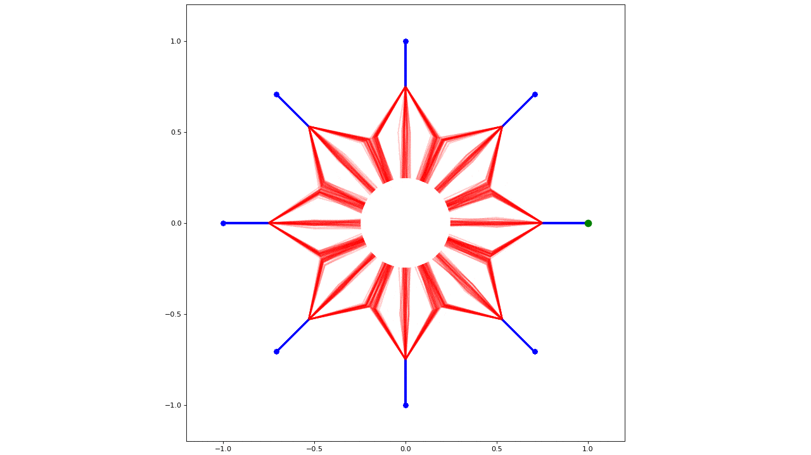

# Social Ways

The pytorch implementation for the paper

**<a href="http://openaccess.thecvf.com/content_CVPRW_2019/papers/Precognition/Amirian_Social_Ways_Learning_Multi-Modal_Distributions_of_Pedestrian_Trajectories_With_GANs_CVPRW_2019_paper.pdf">Social Ways: Learning Multi-Modal Distributions of Pedestrian Trajectories with GANs</a>**  
*<a href="http://people.rennes.inria.fr/Javad.Amirian/">Javad Amirian</a>,
<a href="http://aplicaciones.cimat.mx/Personal/jbhayet">Jean-Bernard Hayet</a>,
<a href="http://people.rennes.inria.fr/Julien.Pettre/">Julien Pettre</a>*  
Presented at [CVPR 2019](http://cvpr2019.thecvf.com) in [*Precognition Workshop*](https://sites.google.com/view/ieeecvf-cvpr2019-precognition) (
[[arxiv](https://arxiv.org/abs/1904.09507)],
[[slides](https://drive.google.com/file/d/1-2UU9l8jjrX65Taqe00NEXp_oYv3JMO5/view?usp=sharing)],
[[poster](https://drive.google.com/file/d/1RNfZEKypbYabAdKpjKej5qlAG5RBR0zn/view?usp=sharing)]
)

This work is, theoretically, an improvement of [Social-GAN](https://arxiv.org/abs/1803.10892) by applying the following changes:
1. Implementing Attention Pooling, instead of Max-Pooling
2. Introducing to use new social features between pair of agents:
- Bearing angle
- Euclidean Distance
- Distance to Closest Approach (DCA)
3. Replacing L2 loss function with Information loss, an idea inspired by [info-GAN](https://arxiv.org/abs/1606.03657)


## System Architecture
The system is composed of two main components: Trajectory Generator and Trajectory Discriminator.
For generating a prediction sample for Pedestrian of Interest (POI), the generator needs the following inputs:
- the observed trajectory of POI,
- the observed trajectory of surrounding agents,
- the noise signal (z),
- and the latent codes (c)

The Discriminator takes a pair of observation and prediction samples and decides, if the given prediction sample is real or fake.
<p align='center'>
  
</p>

## Toy Example
We designed the trajectory toy dataset, to assess the capability of generator in preserving modes of trajectory distribution.
There are six groups of trajectories, all starting from one specific point located along a circle (blue dots). When approaching the circle center, they split into 3 subgroups. Their endpoints are the green dots.
<p align='center'>
  
</p>

In order to create the toy example trajectories, you need to run

```
$ python3 create_toy.py --npz [output file]
```
this will store the required data into a .npz file. The default parameters are:
```
n_conditions = 8
n_modes = 3
n_samples = 768  
```

You can also store the raw trajectories into a .txt file with the following command:
```
$ python3 create_toy.py --txt [output file]
```
For having fun and seeing the animation of toy agents you can call:
```
$ python3 create_toy.py --anim
```


## How to Train
To train the model, please edit the train.py to select the dataset you want to train the model on. The next few lines define some of the most critical parameters values. Then execute:

```
$ python3 train.py
```

## How to Visualize Results

```
$ python3 visualize.py
```

## How to Setup
To run this code you better to use python >= 3.5.
You can use pip to install the required packages.
```bash
$ pip install torch torchvision numpy matplotlib tqdm nose
$ pip install seaborn opencv-python   # to run visualize.py
```


## How to Cite
If you are using this code for your work, please cite:
```
@inproceedings{amirian2019social,
  title={Social ways: Learning multi-modal distributions of pedestrian trajectories with GANs},
  author={Amirian, Javad and Hayet, Jean-Bernard and Pettr{\'e}, Julien},
  booktitle={Proceedings of the IEEE Conference on Computer Vision and Pattern Recognition Workshops (CVPRW)},
  pages={0--0},
  year={2019}
}
```
